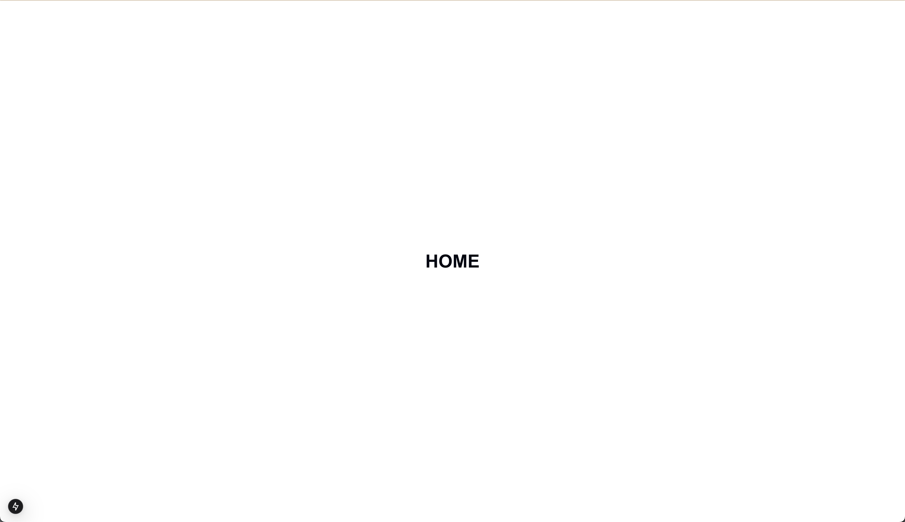
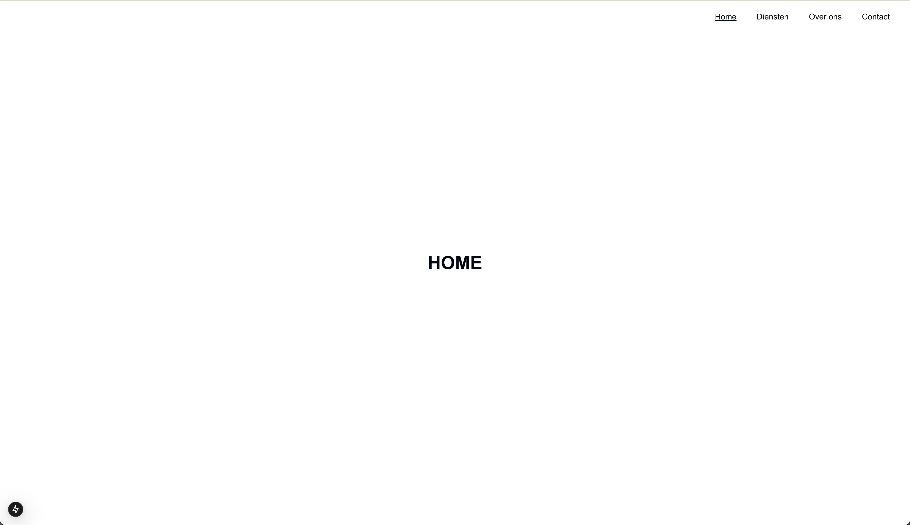

# Week 1: oefeningen portfolio

## Oefening 1

We gaan in deze opdracht een simpele portfolio website maken met een navigatie die de actieve pagina weergeeft.

- Gebruik de `<Pagina />` component om de volgende pagina's te maken:
  - home -> /
  - diensten -> /diensten
  - over-ons -> /over-ons
  - contact -> /contact
  - coming-soon -> /coming-soon

&nbsp;
&nbsp;
&nbsp;

## Opdracht 2

Als de vorige oefening is gelukt heb je nu 5 pagina's aangemaakt. Maar je hebt nog geen gemakkelijke manier om te navigeren tussen de pagina's. In deze opdracht gaan we ervoor zorgen dat de pagina's een navigatie kunnen gebruiken.

- Maak een `layout.tsx` aan genaamd zonder de root layout te overschrijven
- Gebruik in deze layout de `<Navigation />` component om de navigatie te laten zien
- Zorg ervoor dat alle pagina's deze navigatie kunnen gebruiken buiten de coming-soon pagina

