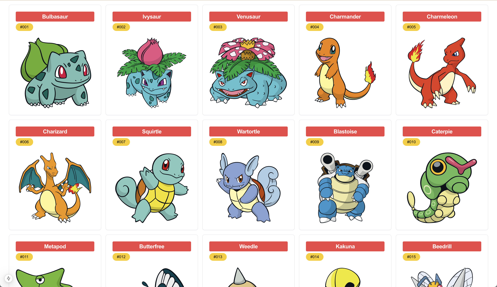
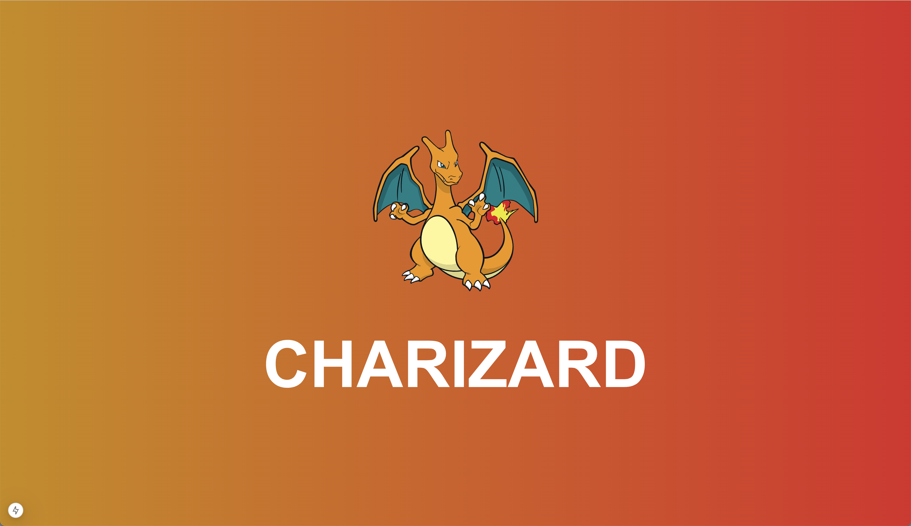
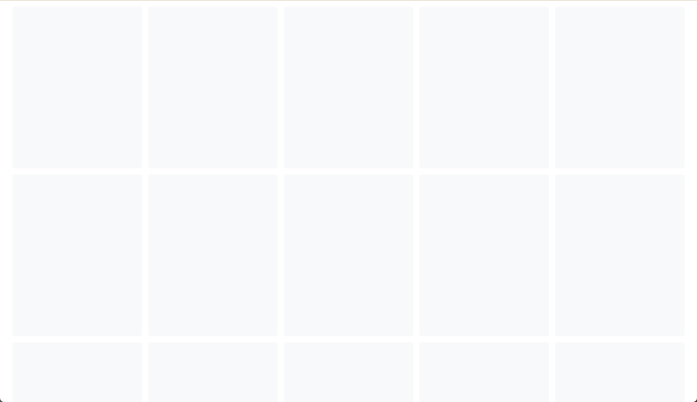

# Week 1: oefeningen Pokemons

## Oefening 1

Je krijgt wat startcode van mij van start te gaan. Kijk deze code na en probeer zoveel mogelijk te begrijpen wat er gebeurt.
Als je klaar bent kun je beginnen met de oefening te maken:

- Maak een nieuw pagina die gevonden kan worden op /pokemons
- Gebruik de `getPokemons` functie om alle pokemons op te halen
- Log de pokemons naar de console en kijk na wat je ontvangt
- Map over de pokemons en toon voor elke pokemon de `<PokemonCard />` component
- Gebruik de `<PokemonGrid />` component om de pokemons te laten zien in een grid
- Je zou dit als resultaat moeten hebben:

&nbsp;
&nbsp;
&nbsp;

## Oefening 2

Als de vorige oefening is gelukt heb je nu een overzicht van alle pokemons. Maar als je op een van de pokemons klikt krijg je een 404 pagina te zien. In deze oefening gaan we dit oplossen door een detail pagina te maken voor elke pokemon.

- Maak een nieuwe pagina die gevonden kan worden op /pokemons/:id
- Gebruik de params die je ontvangt in de props van de pagina om de id van de pokemon te krijgen
- Gebruik de `getPokemonById` functie om de pokemon op te halen met die id
- Gebruik de `<PokemonDetail />` component om de pokemon te laten zien
- Je zou dit als resultaat moeten hebben:

## Oefening 3

Onze pokemons app is nu volledig gereed om te gebruiken. Maar voor dat je de grid of detail pagina kunt gebruiken moet je soms vrij lang wachten. Naar een wit scherm kijken is niet erg plezant. In deze oefening gaan we ervoor zorgen dat we een ladingsscherm tonen zodat de gebruiker weet dat er iets gaat komen.

- Maak een nieuwe pagina genaamd `loading.tsx` in de `app/pokemons` folder
- Gebruik de `<GridSkeleton />` component om de ladingsscherm te laten zien
- Herlaad de `/pokemons` pagina zodat de ladingsscherm getoond wordt
- Maak nog een `loading.tsx` in de `app/pokemons/[id]` folder
- Gebruik de `<PokemonDetailSkeleton />` component om de ladingsscherm te laten zien
- Herlaad de `/pokemons/:id` pagina zodat de ladingsscherm getoond wordt
- Je zou dit als resultaat moeten hebben:

