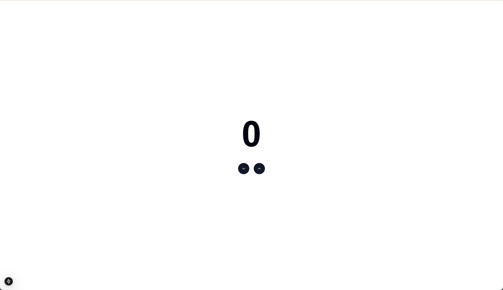
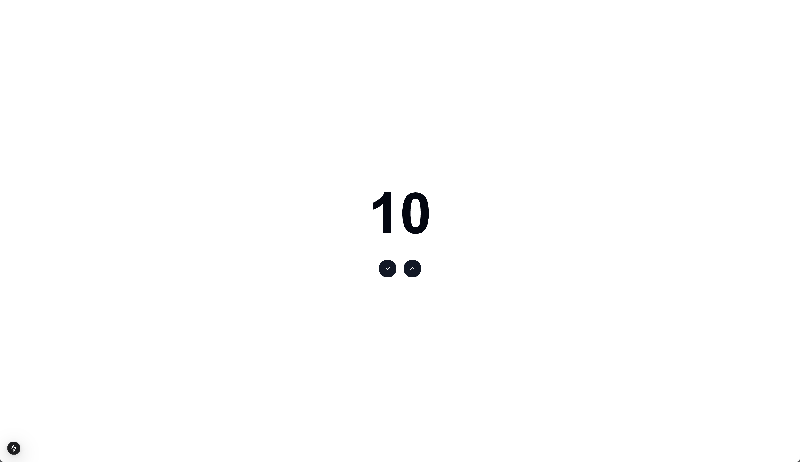

# Week 1: oefeningen Counter

## Oefening 1

Bij deze oefening gaan we een counter bouwen die we kunnen verhogen en verlagen. Tijdens het bouwen van deze counter leren we werken in de client side environment.

- Maak een nieuw component in `app/counter/_components/counter.tsx` genaamd `counter.tsx`
- Gebruik de `<CounterContent />` `<CounterTitle />` en `<CounterButtons />` componenten om de counter op te bouwen
- Zorg ervoor dat de counter start op 0
- Zorg ervoor dat de `count` wordt getoont in de `<CounterTitle />` component
- Zorg ervoor dat de counter kan worden geupdate met de `increment` en `decrement` functies van de `<CounterButtons />` component
- Maak een nieuw pagina die gevonden kan worden op /counter
- Gebruik de `<Counter />` component op de pagina om de counter te laten zien
- Nu zou je aan de hand van de twee knoppen de counter kunnen verhogen en verlagen
- Je zou dit als resultaat moeten hebben:

&nbsp;
&nbsp;
&nbsp;

## Oefening 2

Als de vorige oefening is gelukt heb je nu een werkende counter. Maar elke keer als je reload wordt de counter weer op 0 gestart. In deze oefening gaan we ervoor zorgen dat we de initiele waarde van de counter kunnen bijhouden in de url.

- Ga naar de route `/counter?count=10`
- Haal op de pagina de `searchParams` op en log deze naar de console
- Geef de `count` waarde van de `searchParams` mee aan de `<Counter />` component
- Gebruik deze `count` waarde als initiele waarde van de state van de `<Counter />` component
- Indien er geen `count` waarde is gegeven gebruik dan 0 als initiele waarde
- Nu zou je op de `/counter?count=10` route de counter met waarde 10 moeten laten zien
- Je zou dit als resultaat moeten hebben:

&nbsp;
&nbsp;
&nbsp;

## Oefening 3

Als de vorige oefening is gelukt heb je nu een werkende counter die de initiele waarde kan bijhouden in de url. Maar als je de counter verhoogt of verlaagt verandert de url niet. In deze oefening gaan we ervoor zorgen dat de laatste waarde van de counter in de url wordt opgeslagen.

- Gebruik de `useSearchParams` hook om de `searchParams` op te halen
- Gebruik de `useRouter` hook om de huidige `count` waarde aan te passen in de `searchParams` met de `replace` functie
- Verhoog de counter naar 15 en reload de pagina, kijk of de waarde nog steeds 15 is
- Je zou dit als resultaat moeten hebben:

