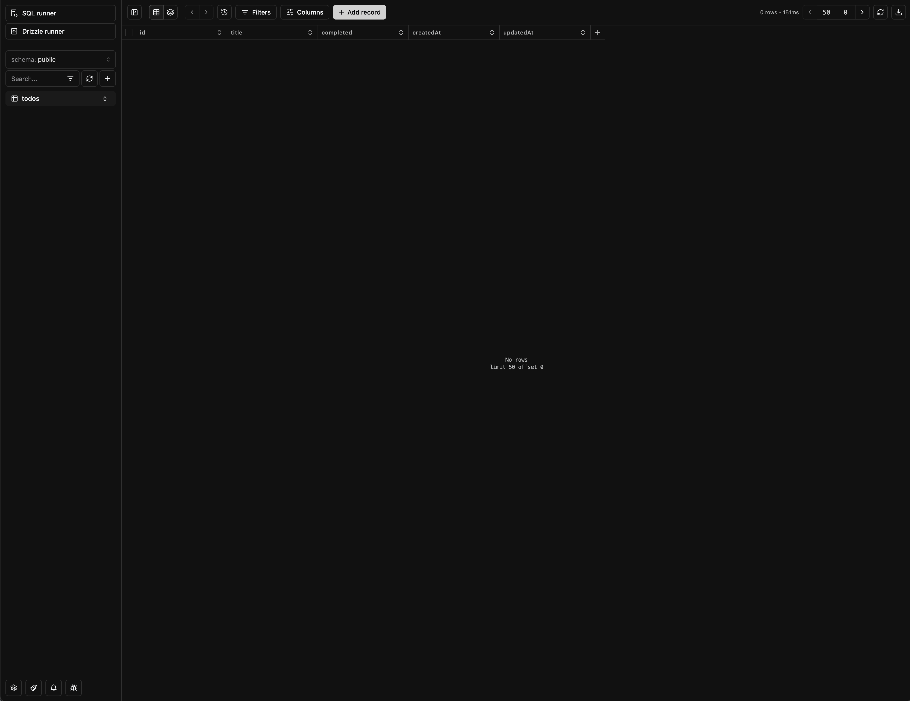

# Week 3: oefeningen

In deze opdracht bouw je een todo applicatie waarbij je leert werken met het ophalen en manipuleren van data via Drizzle ORM en Server Actions. De focus ligt op het correct ophalen, toevoegen, bewerken en verwijderen van taken, en het gebruik van dynamische rendering en server-side form handling.

&nbsp;
&nbsp;
&nbsp;

## Voorbereiding

Om deze oefening te kunnen maken heb je een nieuwe database nodig. Je kan deze maken met docker of andere tools, maar voor deze opdracht gaan we Vercel gebruiken om het gemakkelijk te houden.

- Ga naar je Vercel dashboard: https://vercel.com/dashboard
- Ga naar de **Storage** tab
- Klik op de **Create Database** button
- Kies **Neon** als database provider
- Kies als region de **Frankfurt, Germany (West)** region
- Kies de **Free** plan
- Klik op **Continue** om verder te gaan
- Als laatste kies je **week-3-db** als database name
- Klik op **Create** om de database te maken
- Kopieer de **Database URL** en sla deze op in je `.env-example` file
- Hernoem je `.env-example` file naar `.env`

&nbsp;
&nbsp;
&nbsp;

## Oefening 1

Om onze todo's bij te houden gaan we we een database schema voorzien. Maak een todos table met de volgende kolommen:

- id (uuid,primary key)
- title (string)
- completed (boolean)

&nbsp;

Als je dit correct hebt gedaan dan zou je met de volgende commando je database kunnen vormgevem:

```bash
npm run db:push
```

Na het uitvoeren van deze commando's open je een nieuw terminal tab en voer de volgende commando uit:

```bash
npm run db:studio
```

Surf naar https://local.drizzle.studio om de database te bekijken. Je zou dit als resultaat moeten hebben:



&nbsp;
&nbsp;
&nbsp;

## Opdracht 2

In deze opdracht gaan we onze todos ophalen en tonen in een lijst.

- Voeg handmatig twee todos toe aan de database via Drizzle Studio
- Gebruik de `db` client om deze todos op te halen in de pagina.
- Vervang de meegegeven test data door de todos die je hebt opgehaald
- Bekijk het resultaat nauwkeurig en maak deze zo goed mogelijk na:


&nbsp;
&nbsp;
&nbsp;

## Opdracht 3

In deze stap gaan we het mogelijk maken om todos toe te voegen via de form.

- Maak een Server Function genaamd `addTodo`
- Zorg ervoor dat deze functie een todo toevoegt aan de database
- Voeg nu een item genaamd "Test 3" toe
- Reload de pagina en bekijk het resultaat
- Bekijk het resultaat nauwkeurig en maak deze zo goed mogelijk na:


&nbsp;
&nbsp;
&nbsp;

## Opdracht 4

De volgorde van de todos zijn niet overzichtelijk daarom gaan we deze sorteren.

- Sorteer de todos zodat de afgewerkte todos onderaan staan
- Sorteer de todos zodat de laatste todos bovenaan staan
- Bekijk het resultaat nauwkeurig en maak deze zo goed mogelijk na:


&nbsp;
&nbsp;
&nbsp;

## Opdracht 5

We kunnen de todos nog niet markeren als afgewerkt. In deze opdracht gaan we ervoor zorgen dat de todos kunnen worden afgewerkt.

- Maak een Server Function genaamd `toggleTodo`
- Plaatst deze action op de button met de checkmark
- Zorg ervoor dat deze functie een todo kan worden afgewerkt
- Probeer deze keer de aanpassingen waar te nemen zonder te reloaden (gebruik hiervoor revalidation)
- Zet de zojuist toegevoegde todo als afgewerkt
- Bekijk het resultaat nauwkeurig en maak deze zo goed mogelijk na:


&nbsp;
&nbsp;
&nbsp;

## Opdracht 6

We kunnen de todos nog niet verwijderen. In deze opdracht gaan we ervoor zorgen dat de todos kunnen worden verwijderd.

- Maak een Server Function genaamd `deleteTodo`
- Plaatst deze action op de button met de trashcan
- Zorg ervoor dat deze functie een todo kan worden verwijderd
- Pas in deze opdracht ook revalidation toe
- Verwijder de zojuist afgewerkte todo
- Bekijk het resultaat nauwkeurig en maak deze zo goed mogelijk na:


&nbsp;
&nbsp;
&nbsp;

## Opdracht 7

Een voor een todos verwijderen kan soms wat lang duren, daarom gaan we een nieuwe feature toevoegen die alle afgewerkte todos in een keer verwijderd.

- Maak een Server Function genaamd `deleteCompletedTodos`
- Plaatst deze action op de button **Delete completed todos**
- Zorg ervoor dat deze functie alle afgewerkte todos kan worden verwijderd
- Pas in deze opdracht ook revalidation toe
- Verwijder alle afgewerkte todos
- Bekijk het resultaat nauwkeurig en maak deze zo goed mogelijk na:


